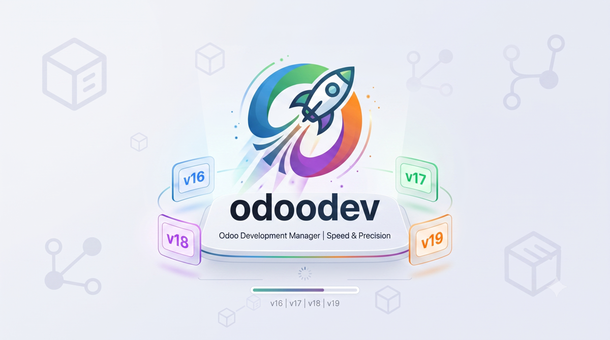
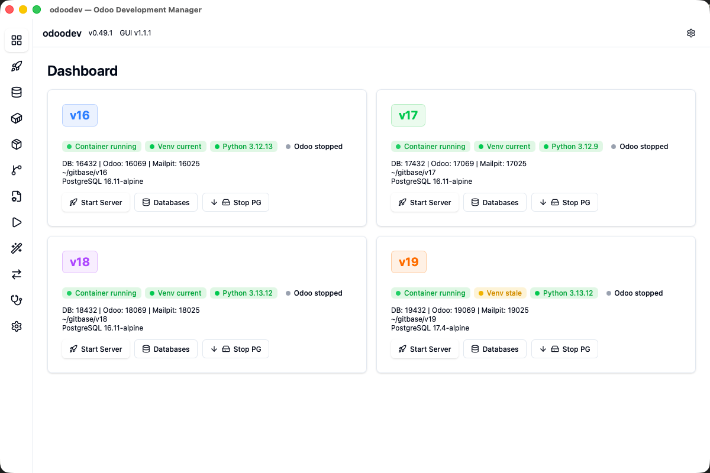

<p align="center">
  
</p>

# odoodev-gui

Native desktop GUI for the [odoodev](https://github.com/equitania/odoo-dev) CLI tool — manage native Odoo development environments (v16–v19) on macOS, Linux and Windows.

> **Language / Sprache:** [🇩🇪 Deutsch](#deutsche-dokumentation) · [🇬🇧 English](#english-documentation)

<p align="center">
  
</p>

<p align="center"><sub>Dashboard: alle vier Versionen (v16–v19) auf einen Blick — Container-, Venv-, Python- und Odoo-Status mit Quick-Actions.</sub></p>

---

## Deutsche Dokumentation

### Projektübersicht

**odoodev-gui** ist eine native Desktop-Anwendung (macOS / Linux / Windows), die eine
grafische Oberfläche für `odoodev` bereitstellt — das einheitliche CLI-Werkzeug zur
Verwaltung nativer Odoo-Entwicklungsumgebungen (Odoo v16–v19).

Die GUI ist eine **reine Präsentationsschicht**: Sie ruft `odoodev` als Subprozess auf
und wertet dessen JSON-/stdout-Ausgabe aus. Es wird keine Python-Logik dupliziert. Die
GUI verwaltet zusätzlich `uv` (installiert es bei Bedarf) und `odoodev` (installiert /
aktualisiert es via `uv tool`).

> **Status:** v1.1.1 — feature-complete. Alle Panels für v16–v19 implementiert
> (Dashboard, Server, Datenbanken, Docker/Container, Venv, Repos, Env, Playbooks, Init,
> Migrate, Doctor, Einstellungen), Apple-Container-Integration aktiv, DE/EN-i18n,
> Cross-Platform-Builds (macOS/Windows/Linux) mit eingebautem Auto-Update.

### Download & Installation

Lade den aktuellen Installer für deine Plattform von der
**[Releases-Seite](https://github.com/eqms/odoodev-gui/releases/latest)** herunter:

| Plattform | Datei | Installation |
|-----------|-------|--------------|
| **macOS** (Apple Silicon) | `odoodev-gui_1.1.1_aarch64.dmg` | `.dmg` öffnen, **odoodev-gui** in **Programme** ziehen. Beim ersten Start Rechtsklick auf die App → **Öffnen** (der Build ist noch nicht notarisiert). |
| **Windows** | `odoodev-gui_1.1.1_x64-setup.exe` | Installer ausführen. Beim ersten Start warnt ggf. SmartScreen — **Weitere Informationen → Trotzdem ausführen** (noch nicht code-signiert). |
| **Linux** | `odoodev-gui_1.1.1_amd64.AppImage` · `odoodev-gui_1.1.1_amd64.deb` | AppImage ausführbar machen (`chmod +x`) und starten, oder das `.deb` unter Debian/Ubuntu installieren. |

> Beim ersten Start installiert `odoodev-gui` seine eigenen Abhängigkeiten (`uv` und die
> `odoodev`-CLI), falls sie fehlen.

### Auto-Update

Die App prüft beim Start auf Updates und bietet ein Ein-Klick-Update an (auch unter
**Einstellungen → Nach Updates suchen**). Jedes Update wird kryptografisch gegen den
Signaturschlüssel von Equitania verifiziert (Ed25519/minisign) — es werden nur
authentische Builds installiert, kein manuelles Neu-Herunterladen für neue Releases.

### Funktionen

**Dashboard** — 4 Version-Cards (v16–v19) mit Status-Badges (Docker/Container, Venv,
Python, Odoo), Polling, Docker Up/Down inline, Quick-Actions (Server starten, Datenbanken).

**Server** — alle 4 Versionen als Tabs, ServerConfig (5 Modi: Normal/Dev/Shell/Test/
Prepare, Datenbank-Dropdown, Modul-Update/Install, Advanced: Host, Sprache,
Clean-Sessions, Config, Default-Credentials, Extra-Args), LogViewer mit Virtual
Scrolling, Level-Filter (DEBUG/INFO/WARNING/ERROR/CRITICAL), Suche, Auto-Scroll, Copy,
Syntax-Highlighting, Buffer-Persistenz über Stop/Start.

**Datenbanken** — DB-Liste, Backup (SQL/ZIP/tar.zst mit Level), Restore (3-Schritt-Wizard
mit Dry-Run, Sanitize, Anonymize, Purge, Recompute), Drop (type-to-confirm), Copy, Rename,
Bulk-Drop, Operation-Progress mit live stdout.

**Weitere Panels** — Docker/Container (up/down/status/logs, Benchmark), Venv
(setup/check/remove), Repos (clone/update/config-regenerate, streaming), Env
(check/setup/show/dir), Playbook-Runner (NDJSON-Live-Fortschritt), Init-Wizard,
Migrate-Panel (Migrationsgruppen verwalten), Doctor / Health-Check, Einstellungen.

**Plattform & Betrieb** — Apple-Container-Integration (Runtime-Erkennung aus odoodev-Config
`container_runtime: apple`, `container ls --format json`, Docker wird nie angerührt wenn
Config apple sagt), Auto-Install-Dialog bei fehlendem uv/odoodev, Update-Badge bei neuer
odoodev-Version (PyPI-Check), Toast-Notifications, volle DE/EN-i18n mit Sprachumschaltung
und Persistenz.

### Erste Schritte (Entwicklung)

```bash
pnpm install                    # Frontend-Abhängigkeiten installieren
~/.cargo/bin/cargo-tauri dev    # Dev-Modus (Hot-Reload Frontend + Rust-Rebuild)
~/.cargo/bin/cargo-tauri build  # Produktions-Build
```

**Voraussetzungen:** Rust 1.75+, Node.js 20+, pnpm, Tauri CLI v2
(`cargo install tauri-cli --version "^2"`), `odoodev` installiert
(`uv tool install odoodev-equitania`).

### Dokumentation

| Dokument | Inhalt |
|----------|--------|
| [CLAUDE.md](CLAUDE.md) | Projekt-Leitfaden für Claude Code |
| [docs/PLAN.md](docs/PLAN.md) | Vollständiger Umsetzungsplan mit allen Phasen |
| [docs/ARCHITECTURE.md](docs/ARCHITECTURE.md) | Systemarchitektur, Datenfluss, Dateistruktur, Code-Beispiele |
| [docs/CLI_INTEGRATION.md](docs/CLI_INTEGRATION.md) | CLI-Integrationsmatrix, JSON-Formate, Parsing-Strategien |
| [docs/TAURI_API.md](docs/TAURI_API.md) | Tauri-IPC-Command-API-Referenz (alle invoke/listen-Signaturen) |
| [docs/DECISIONS.md](docs/DECISIONS.md) | Entscheidungslog mit allen bestätigten Design-Entscheidungen |

### Verwandte Projekte

- **odoodev CLI:** [odoo-dev Repository](https://github.com/equitania/odoo-dev) (PyPI: `odoodev-equitania`)
- **Agent Capability Card:** `usage/AGENT.md` im odoodev-Repo

### Lizenz

AGPL-3.0-or-later (identisch mit odoodev). Copyright © 2026 Equitania Software GmbH ·
[www.ownerp.com](https://www.ownerp.com) · info@ownerp.com

---

## English Documentation

### Project Overview

**odoodev-gui** is a native desktop application (macOS / Linux / Windows) that provides a
graphical interface for `odoodev` — the unified CLI tool for managing native Odoo
development environments (Odoo v16–v19).

The GUI is a **pure presentation layer**: it shells out to `odoodev` as a subprocess and
parses its JSON / stdout output. No Python logic is duplicated. The GUI also manages `uv`
(installs it if missing) and `odoodev` (installs / upgrades it via `uv tool`).

> **Status:** v1.1.1 — feature-complete. All panels for v16–v19 implemented (Dashboard,
> Server, Databases, Docker/Container, Venv, Repos, Env, Playbooks, Init, Migrate, Doctor,
> Settings), Apple Container integration active, DE/EN i18n, cross-platform builds
> (macOS/Windows/Linux) with built-in auto-update.

### Download & Install

Grab the latest installer for your platform from the
**[Releases page](https://github.com/eqms/odoodev-gui/releases/latest)**:

| Platform | File | Install |
|----------|------|---------|
| **macOS** (Apple Silicon) | `odoodev-gui_1.1.1_aarch64.dmg` | Open the `.dmg`, drag **odoodev-gui** into **Applications**. On first launch, right-click the app → **Open** (the build is not yet notarized). |
| **Windows** | `odoodev-gui_1.1.1_x64-setup.exe` | Run the installer. On first launch, Windows SmartScreen may warn — click **More info → Run anyway** (the app is not yet code-signed). |
| **Linux** | `odoodev-gui_1.1.1_amd64.AppImage` · `odoodev-gui_1.1.1_amd64.deb` | Make the AppImage executable (`chmod +x`) and run it, or install the `.deb` on Debian/Ubuntu. |

> On first run, `odoodev-gui` installs its own dependencies (`uv` and the `odoodev` CLI)
> if they are missing.

### Auto-Update

The app checks for updates on launch and offers a one-click update (also under
**Settings → Check for Updates**). Every update is cryptographically verified against
Equitania's signing key (Ed25519/minisign), so only authentic builds get installed — no
manual re-downloading for new releases.

### Features

**Dashboard** — 4 version cards (v16–v19) with status badges (Docker/Container, Venv,
Python, Odoo), polling, inline Docker Up/Down, quick actions (Start Server, Databases).

**Server** — all 4 versions as tabs, ServerConfig (5 modes: Normal/Dev/Shell/Test/Prepare,
database dropdown, module update/install, advanced: host, language, clean-sessions, config,
default credentials, extra args), LogViewer with virtual scrolling, level filter
(DEBUG/INFO/WARNING/ERROR/CRITICAL), search, auto-scroll, copy, syntax highlighting,
buffer persistence across stop/start.

**Databases** — DB list, backup (SQL/ZIP/tar.zst with level), restore (3-step wizard with
dry run, sanitize, anonymize, purge, recompute), drop (type-to-confirm), copy, rename,
bulk drop, operation progress with live stdout.

**More panels** — Docker/Container (up/down/status/logs, benchmark), Venv
(setup/check/remove), Repos (clone/update/config-regenerate, streaming), Env
(check/setup/show/dir), Playbook Runner (NDJSON live progress), Init Wizard, Migrate panel
(migration group management), Doctor / Health Check, Settings.

**Platform & operation** — Apple Container integration (runtime detection from odoodev
config `container_runtime: apple`, `container ls --format json`, Docker is never touched
when config says apple), auto-install dialog for missing uv/odoodev, update badge for new
odoodev version (PyPI check), toast notifications, full DE/EN i18n with language switch and
persistence.

### Getting Started (Development)

```bash
pnpm install                    # install frontend deps
~/.cargo/bin/cargo-tauri dev    # dev mode (hot-reload frontend + Rust rebuild)
~/.cargo/bin/cargo-tauri build  # production build
```

**Prerequisites:** Rust 1.75+, Node.js 20+, pnpm, Tauri CLI v2
(`cargo install tauri-cli --version "^2"`), `odoodev` installed
(`uv tool install odoodev-equitania`).

### Tech Stack

- **Backend:** Rust + Tauri v2
- **Frontend:** React 19 + TypeScript + Vite 8
- **UI:** Tailwind CSS v4 + shadcn/ui primitives
- **State:** Zustand (+ toast notification system)
- **Icons:** lucide-react
- **Virtual scrolling:** @tanstack/react-virtual (log viewer with 10k+ lines)
- **Distribution:** native bundles (.dmg / .exe / .AppImage / .deb) with built-in
  auto-update (Tauri updater, minisign-signed)

### Documentation

| Document | Content |
|----------|---------|
| [CLAUDE.md](CLAUDE.md) | Project guidance for Claude Code |
| [docs/PLAN.md](docs/PLAN.md) | Full implementation plan with all phases and time estimates |
| [docs/ARCHITECTURE.md](docs/ARCHITECTURE.md) | System architecture, data flow, file structure, code examples |
| [docs/CLI_INTEGRATION.md](docs/CLI_INTEGRATION.md) | CLI integration matrix, JSON formats, parsing strategies |
| [docs/TAURI_API.md](docs/TAURI_API.md) | Tauri IPC command API reference (all invoke/listen signatures) |
| [docs/DECISIONS.md](docs/DECISIONS.md) | Decision log with all user-confirmed design choices |

### Related

- **odoodev CLI:** [odoo-dev repository](https://github.com/equitania/odoo-dev) (PyPI: `odoodev-equitania`)
- **Agent Capability Card:** `usage/AGENT.md` in the odoodev repo

### License

AGPL-3.0-or-later (same as odoodev). Copyright © 2026 Equitania Software GmbH ·
[www.ownerp.com](https://www.ownerp.com) · info@ownerp.com
